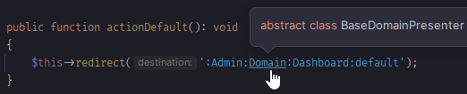
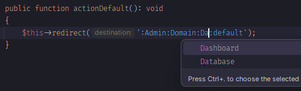
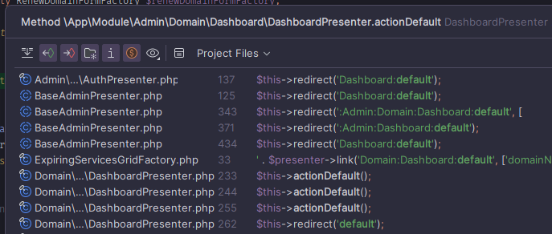
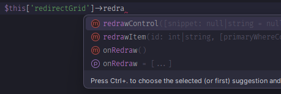

Nette for PhpStorm and IntelliJ IDEA
=========================================

[](https://plugins.jetbrains.com/plugin/28342-nette-helpers)
[](https://github.com/noctud/intellij-nette/actions)

[](https://discord.noctud.dev)

<!-- Plugin description -->
A lightweight PhpStorm plugin that provides smart IDE support for the [Nette Framework](https://nette.org/). It adds autocompletion, navigation, type inference, and implicit usage detection for presenters, components, and links.

If you have any problems with the plugin, [create an issue](https://github.com/noctud/intellij-nette/issues/new/choose) or join the [Noctud Discord](https://discord.noctud.dev).
<!-- Plugin description end -->

<table>
  <tr>
    <td><b>Ctrl+click navigation to presenters</b><br></td>
    <td><b>Autocompletion in links</b><br></td>
  </tr>
  <tr>
    <td><b>Find Usages across link strings</b><br></td>
    <td><b>Component type inference</b><br></td>
  </tr>
</table>

Installation
------------
Settings → Plugins → Marketplace → Search for "Nette" → Install → Apply


Installation from .jar file
------------
Download the `instrumented.jar` file from the [latest release](https://github.com/noctud/intellij-nette/releases) or the latest successful [GitHub Actions build](https://github.com/noctud/intellij-nette/actions).


Supported Features
------------------

### Links
* Autocompletion for action, signal, and presenter names in `link()`, `redirect()`, `forward()`, and related methods
* Ctrl+click navigation from link strings to presenter classes and action/signal methods
* Module hierarchy support (e.g. `:Web:Server:Detail:default`)
* Highlighted link destination strings
* Find Usages shows link string references for action/signal methods

### Components
* Autocompletion for component names in `$this['...']` and `$this->getComponent('...')`
* Type inference for component access — resolves return types from `createComponent*()` methods

### Presenter methods
* `action*`, `render*`, `handle*`, `createComponent*`, `startup`, `beforeRender`, `afterRender`, `shutdown` are marked as implicitly used
* Nette Component subclasses are marked as implicitly used

Building
------------

```sh
./gradlew build
```

Testing in sandbox IDE
------------

```sh
./gradlew runIde
```
